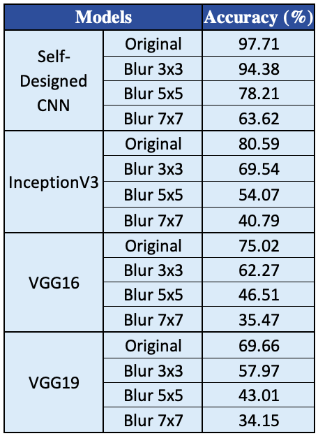

# DMML2_project
(The repository for the Data Mining &amp; Machine Learning continuous assessment group project.)

A large traffic sign image dataset was imported, explored, analysed, cleaned, pre-processed, transformed and then fed into various models by following the KDD methodology. In total, four models were compared, in which the first was a simple, self-designed CNN model, whereas the rest of the three were pre-trained Transfer Learning models, namely, InceptionV3, VGG16 and VGG19. The models were tested comprehensively by applying the Gaussian blurring technique to the image dataset. The classifier layers were intentionally kept the same across all the models to make the comparison easier. The self-designed CNN model managed to perform the best (best accuracy: 97.71\%; training time: 361.44s), followed by the InceptionV3 model (best accuracy: 80.59\%; training time: 332.37s), then the VGG16 model (best accuracy: 75.02\%; training time: 665.41s) and the VGG19 model (best accuracy: 69.66\%; training time: 801.50s).  

### Libraries/Packages used:
- numpy
- pandas
- matplotlib
- seaborn
- tensorflow-keras 2.0
- scikit-learn

### Data Sources:
The dataset used in this project was sourced directly from the Kaggle repository -- _German Traffic Sign Recognition Benchmark_ (GTSRB), created by the user [_Mykola_](https://www.kaggle.com/meowmeowmeowmeowmeow/gtsrb-german-traffic-sign).

The dataset is licensed under public domain, so its use does not pose any ethical concerns.

### Data Overview:
Most CNN models on traffic signs have trained their models on the GTSRB database as it was used in the _International Joint Conference on Neural Networks_ (IJCNN) in 2011. The GTSRB dataset is a single-image, multi-class dataset with more than 40 classes available for classification. The dataset consists of more than 50,000 images in total. Speed and accuracy of a network will undoubtedly be the two main challenges in a large dataset like GTSRB.

### Project Design:

### Some Results:

### Report:
The final report that was submitted for the DAP project can be viewed/downloaded from [this link]().

### Future Work:
Since deep learning and TL are ever evolving topics, coupled with the constant updates in the self-driving and traffic detection automation fields, much progress can be done in future iterations of this project:
- The GTSRB dataset contained $\sim50,000$ images, further compounded by the blurring techniques applied and resulting in a massive 87,500 image dataset. But by comparison with the massive datasets such as ImageNet, a lot more images can be added in the input data to increase the training materials for the models. One way to achieve this could be augmentation of images, i.e., shifting and/or rotating the images to increase diversity.
- Although the comparison tests done in this project were under controlled circumstances, some other variables could be constricted, in further instalments, to drive the point home. For instance, the code of this project was compiled on _Google Colab_ notebooks because of the lack of GPU-enabled machines, which resulted in the addition of a lesser known degree of freedom to the equation -- since the GPU was allotted by the _Google Cloud_ system automatically, and because there are many varieties of GPUs used by _Google_, the hardware used to train and test the models may have differed at some step of the project. Although this will not affect the results massively, making sure that the same GPU is allotted every time the model is implemented may help train the models faster by a few seconds. But nonetheless, this can be overlooked if the code is compiled on physical hardware that is same for all the models.
- A relatively simple automated system can be designed in future iterations of the project. The best model can be selected and then tested by attaching a low-quality camera that live-feeds the images of traffic signs and symbols into the automated system. This would introduce real-life variables in the stew, and will help shed light on the challenges to fully automated self-driving.

